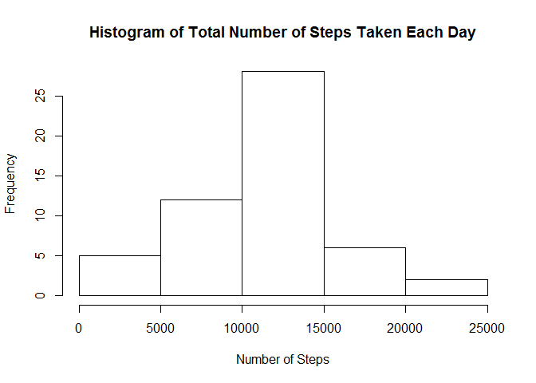
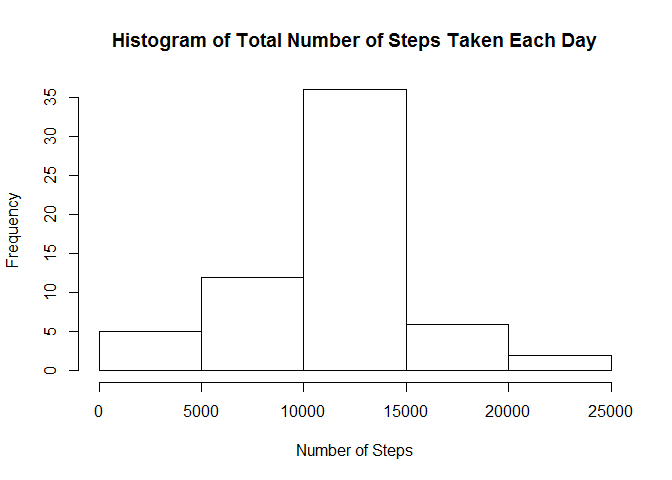
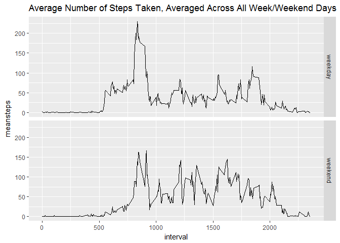

# Reproducible Research: Peer Assessment 1


## Loading and preprocessing the data


```r
unzip("activity.zip")   
activity<-read.csv("activity.csv")
library(plyr)
```

## What is mean total number of steps taken per day?  

**For this part of the assignment, the missing values in the dataset are ignored.**


```r
actcomp <- activity[complete.cases(activity),]    
```

**1. Calculate the total number of steps taken per day**


```r
total1<-ddply(actcomp,.(date),summarize,sumsteps=sum(steps))  
```

**2. Make a histogram of the total number of steps taken each day**


```r
 hist(total1$sumsteps,xlab="Number of Steps",
     main="Histogram of Total Number of Steps Taken Each Day")     
```

<!-- -->

**3.  Calculate and report the mean and median of the total number of steps taken per day**


```r
summary(total1$sumsteps)   
```

```
##    Min. 1st Qu.  Median    Mean 3rd Qu.    Max. 
##      41    8841   10760   10770   13290   21190
```

```r
#This part of the code is to separate out the mean and median values so they can be reported in the text.   

summarytotal1<-as.character(summary(total1$sumsteps))
mean1<-summarytotal1[4]    
median1<-summarytotal1[3]
```

*The mean and median of the total number of steps taken per day are 10770 and  10760, respectively.*


## What is the average daily activity pattern?

**1.Make a time series plot (i.e. type = "l") of the 5-minute interval (x-axis) and the average number of steps taken, averaged across all days (y-axis)**


```r
actcomp$interval<-as.factor(actcomp$interval)  

mean2<-ddply(actcomp,.(interval),summarize,meansteps=mean(steps))     

plot(mean2$interval,mean2$meansteps,xlab="Interval", 
     ylab="Number of Steps",main="Average Number of Steps Taken, Averaged Across All Days")   
points(mean2$interval,mean2$meansteps,type="l")
```

<!-- -->

**2.Which 5-minute interval, averaged across all the days in the dataset, contains the maximum number of steps?**


```r
max<-mean2[mean2$meansteps==max(mean2$meansteps),]
print(max)
```

```
##     interval meansteps
## 104      835  206.1698
```

```r
#This part of the code is to separate out the maximum interval value so it can be reported in the text.

max$interval<-as.character(max$interval)
maxint<-max[1,1]
```

*The 5-minute interval, averaged across all the days in the dataset, that contains the maximum number of steps is interval 835.* 

## Imputing missing values

**1.Calculate and report the total number of missing values in the dataset (i.e. the total number of rows with NAs)**


```r
x<-sum(is.na(activity$steps))
print(x)
```

```
## [1] 2304
```

*The total number of missing values in the data set is 2304.*

**2.Devise a strategy for filling in all of the missing values in the dataset. The strategy does not need to be sophisticated. For example, you could use the mean/median for that day, or the mean for that 5-minute interval, etc.**

*The missing values are replaced with the mean for that 5-minute interval.*

**3.Create a new dataset that is equal to the original dataset but with the missing data filled in.**


```r
activity$steps <- with(activity, ave(steps, interval,
        FUN = function(x) replace(x, is.na(x), mean(x, na.rm = TRUE))))
```

**4.Make a histogram of the total number of steps taken each day and Calculate and report the mean and median total number of steps taken per day. Do these values differ from the estimates from the first part of the assignment? What is the impact of imputing missing data on the estimates of the total daily number of steps?**


```r
total3<-ddply(activity,.(date),summarize,sumsteps=sum(steps))

hist(total3$sumsteps,xlab="Number of Steps",
     main="Histogram of Total Number of Steps Taken Each Day")   
```

<!-- -->

```r
summary(total3$sumsteps) 
```

```
##    Min. 1st Qu.  Median    Mean 3rd Qu.    Max. 
##      41    9819   10770   10770   12810   21190
```

```r
#This part of the code is to separate out the mean and median values so they can be reported in the text.  The difference between the means and medians with and without NA's are also calculated.

summarytotal3<-as.character(summary(total3$sumsteps))
mean3<-summarytotal3[4]
median3<-summarytotal3[3]

meandif<-as.numeric(mean3)-as.numeric(mean1)
mediandif<-as.numeric(median3)-as.numeric(median1)
```

*The mean and median of the total number of steps taken per day are 10770 and  10770, respectively.  The mean and median of the total number of steps taken per day with the NA's removed were 10770 and  10760, respectively.  The difference in the mean is 0 steps and the difference in the median is 10 steps.  Replacing the missing values with the mean for that 5-minute interval has no effect on the mean and a very small effect on the median.* 


## Are there differences in activity patterns between weekdays and weekends?  

**For this part the weekdays() function may be of some help here. Use the dataset with the filled-in missing values for this part.**

**1.Create a new factor variable in the dataset with two levels - "weekday" and "weekend" indicating whether a given date is a weekday or weekend day.**


```r
activity$date<-as.Date(activity$date)

wk<-ddply(activity, .(date), transform, wkdy=weekdays(date))
wkend<-ddply(wk, .(wkdy), transform, day=ifelse(wkdy=="Saturday"|
                        wkdy=="Sunday", "weekend", "weekday"))
```

**2.Make a panel plot containing a time series plot (i.e. type = "l") of the 5-minute interval (x-axis) and the average number of steps taken, averaged across all weekday days or weekend days (y-axis). See the README file in the GitHub repository to see an example of what this plot should look like using simulated data.**


```r
wkend$interval<-as.factor(wkend$interval)
mean4<-ddply(wkend,.(interval,day),summarize,meansteps=mean(steps))

mean4$interval<-as.character(mean4$interval)
mean4$interval<-as.numeric(mean4$interval)

library(ggplot2)

g<-ggplot(mean4,aes(interval,meansteps))
g+facet_grid(day~.)+geom_line()+ggtitle("Average Number of Steps Taken, Averaged Across All Week/Weekend Days")
```

<!-- -->

